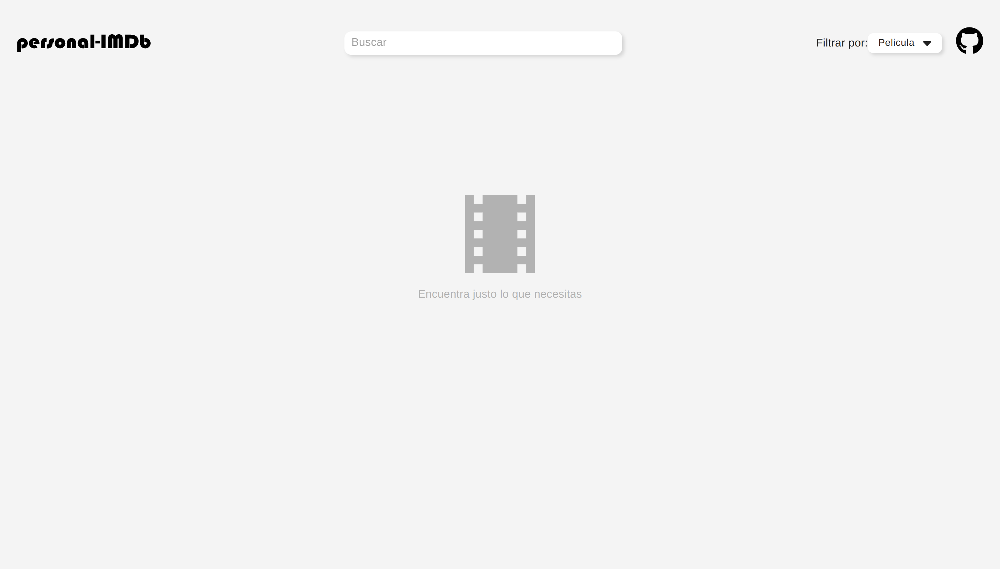

# Personal IMDB

An application used to find data about films from [OMDb API](https://www.omdbapi.com/) based on user preference, built with React, Axios and Material-UI v4.

## Project Screen Shot(s)

## Installation and Setup Instructions

Clone down this repository. You will need `node` and `npm` or `yarn` installed globally on your machine.

Installation:

`npm install` | `yarn install`

To Start Server:

`npm start` | `yarn start`

To Visit App:

`localhost:3000`  

